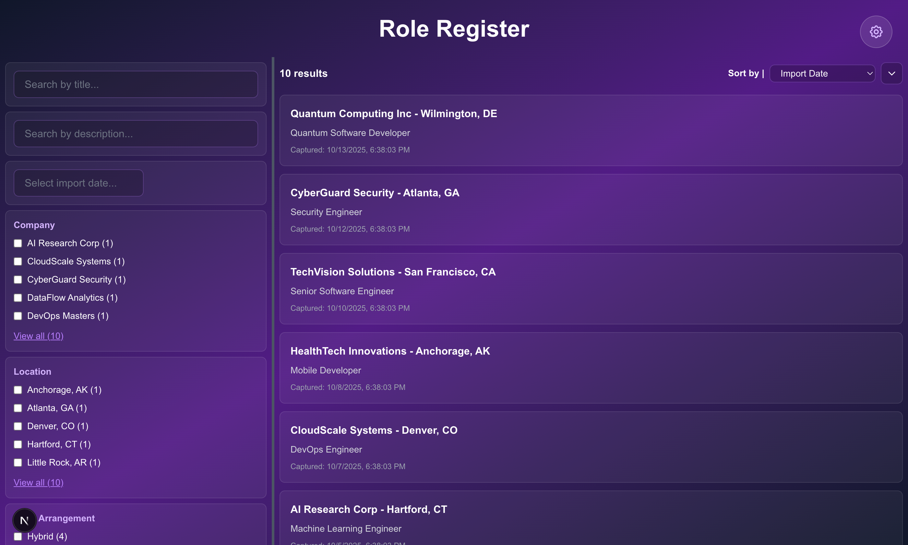
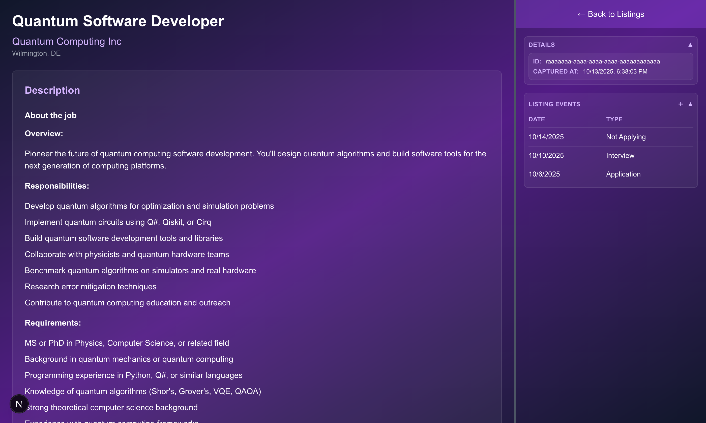
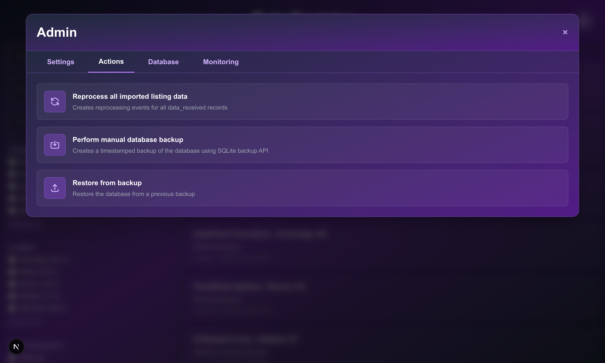

# Role Register

Role Register is a **local-first job application tracking system** built with Next.js 15 and SQLite. It captures job postings from LinkedIn via a Chrome extension, extracts requirements using pattern-based parsing, and helps you manage your job search with event tracking and application status management.

---
<br/>


## Current Features

### Job Posting Capture
- **Chrome Extension Integration**: Capture job postings directly from LinkedIn job pages
- **Automatic Data Processing**: Background worker extracts job title, company, location, and description
- **Pattern-Based Requirement Extraction**: Identifies required and nice-to-have qualifications from job descriptions
- **Local Storage**: All data stored locally in SQLite database

<br/>


### Role Listing Management
- **Detailed View**: Split-pane interface with resizable divider showing job description and metadata
- **Event Tracking**: Track application timeline with custom events (Application, Interview, Offer, Not Applying)
- **Status Management**: Mark listings with application status and dates
- **Company & Location Data**: Automatic extraction and normalization of company names and locations

<br/>

<br/>

### Data Management
- **Admin Interface**: 
  - **Settings Tab**: Configure application settings (storage location)
  - **Actions Tab**: 
    - Reprocess all imported listing data
    - Manual database backup
    - Restore from backup
  - **Database Tab**: View and manage raw data in all tables
- **Reprocessing**: Re-run extraction on captured job postings (single or bulk)
- **HTML Viewer**: Collapsible tree view of captured HTML with syntax highlighting and search
- **Database Backup & Restore**:
  - Automatic startup backup (creates backup if database changed since last backup)
  - Periodic automatic backups (configurable interval, default 15 minutes)
  - Manual backup with timestamp
  - Restore from backup with dropdown selection showing all backups
  - Uses SQLite backup API for safe, consistent backups
  - WAL checkpointing before backup ensures complete data capture
  - Worker threads automatically coordinated during restore operations

### Developer Features
- **Comprehensive Test Suite**: 134 BDD-style unit tests with Vitest and React Testing Library
- **Type Safety**: Full TypeScript coverage
- **Worker Threads**: Background processing for HTML parsing and requirement extraction

---

## Tech Stack

- **Framework**: Next.js 15 with App Router and React 19
- **Styling**: Tailwind CSS v4
- **Database**: SQLite with better-sqlite3 and Drizzle ORM
- **Testing**: Vitest, React Testing Library, jsdom
- **HTML Parsing**: Cheerio
- **Chrome Extension**: Manifest V3

---

## Getting Started

### Prerequisites
- Node.js (v18 or later recommended)
- npm package manager
- Chrome browser (for extension)

### Installation

1. Clone the repository:
```bash
git clone https://github.com/jamesandrewmyers/role-register.git
cd role-register
```

2. Install dependencies:
```bash
npm install
```

3. Build the worker:
```bash
npm run build:worker
```

4. Start the development server:
```bash
npm run dev
```

The application will be available at `http://localhost:3000`

### Chrome Extension Setup

1. Open Chrome and navigate to `chrome://extensions/`
2. Enable "Developer mode" (toggle in top right)
3. Click "Load unpacked"
4. Select the `chrome-extension` directory from this project
5. Navigate to a LinkedIn job posting
6. Click the extension icon to capture the job data

### Backup Configuration (Optional)

By default, Role Register automatically backs up your database:
- On startup (if changes detected since last backup)
- Every 15 minutes (if changes detected)

To customize the backup interval:

1. Insert a setting into the database:
```sql
INSERT INTO settings (id, name, value, updatedAt) 
VALUES (
  lower(hex(randomblob(16))), 
  'backup_interval_minutes', 
  '30',  -- Change to desired minutes
  strftime('%s', 'now')
);
```

2. Restart the application

Backups are stored in the `data/` directory with timestamps (e.g., `role_register_backup_2025-01-15T14-30-00.sqlite`).

---

## Development

### Available Scripts

- `npm run dev` - Start development server with Turbopack
- `npm run build` - Build production application
- `npm start` - Start production server
- `npm run lint` - Run ESLint
- `npm test` - Run test suite
- `npm run test:ui` - Run tests with UI
- `npm run test:coverage` - Run tests with coverage report

### Testing

The project includes comprehensive unit tests:
- 109 component tests covering UI behavior, user interactions, and edge cases
- 25 utility tests for requirement extraction logic
- All tests follow behavior-driven development (BDD) patterns

Run tests:
```bash
npm test
```

---

## Architecture

### Domain-Driven Design

Role Register follows Domain-Driven Design (DDD) principles with clear separation of concerns:

```
┌─────────────────────────────────────────────────────────┐
│                     Presentation Layer                   │
│  (React Components, Next.js API Routes)                 │
│  Uses: DTOs (Data Transfer Objects)                     │
└─────────────────┬───────────────────────────────────────┘
                  │
┌─────────────────▼───────────────────────────────────────┐
│                      Service Layer                       │
│  (Business Logic, Data Orchestration)                   │
│  Uses: Domain Entities with Branded Types               │
└─────────────────┬───────────────────────────────────────┘
                  │
┌─────────────────▼───────────────────────────────────────┐
│                     Mapper Layer                         │
│  (Persistence ↔ Domain Translation)                     │
│  Converts: DB Records ↔ Domain Entities                 │
└─────────────────┬───────────────────────────────────────┘
                  │
┌─────────────────▼───────────────────────────────────────┐
│                   Persistence Layer                      │
│  (SQLite Database via Drizzle ORM)                      │
│  Schema: Tables, Columns, Relations                     │
└─────────────────────────────────────────────────────────┘
```

**Key Architectural Components:**

- **Domain Entities** (`src/domain/entities/`): Type-safe business objects with branded IDs
- **Mappers** (`src/domain/mappers/`): Convert between database records and domain entities
- **Services** (`src/services/`): Business logic using domain entities exclusively
- **DTOs** (`src/dto/`): Data Transfer Objects for API/UI layer
- **Persistence** (`src/lib/schema.ts`, `src/lib/db.ts`): Database schema and connection

### Data Flow

1. **Capture**: Chrome extension sends job posting HTML to `/api/import`
2. **Store**: Raw HTML stored in database via `dataReceivedService`
3. **Queue**: Processing event created via `eventInfoService`
4. **Process**: Worker thread parses HTML using `LinkedInParser`, creates domain entities via services
5. **Transform**: Services use mappers to persist domain entities to database
6. **Serve**: API routes convert domain entities to DTOs for presentation layer
7. **Display**: React components consume DTOs to render UI

### Database Schema

**Core Tables:**
- `data_received`: Raw captured HTML and metadata
- `role_listing`: Processed job postings with status tracking
- `role_company`: Normalized company data
- `role_location`: Normalized location data (city/state)
- `role_state`: US state reference data
- `role_qualifications`: Extracted requirements (required and nice-to-have)
- `role_listing_event`: Application timeline events
- `event_info`: Background processing queue
- `settings`: Application configuration (includes `backup_interval_minutes`)

**Type Safety:**
All entities use branded types (e.g., `RoleListingId`, `RoleCompanyId`) to prevent ID mixing at compile time.

---

## Privacy & Data

**All data is stored locally on your machine.**

- No remote accounts required
- No data transmission to external services
- SQLite database stored in `data/` directory
- Automatic backups stored in `data/` directory with timestamps
- Chrome extension only communicates with `localhost:3000`
- WAL mode enabled for crash protection and safe concurrent access

---

## Project Status

**Pre-Alpha**: Core functionality implemented but under active development.

### Implemented
✅ Job posting capture from LinkedIn  
✅ Pattern-based requirement extraction  
✅ Event tracking and status management  
✅ Admin data management interface  
✅ Comprehensive test coverage  
✅ Automatic database backup system  
✅ Manual backup and restore functionality  
✅ Configurable backup intervals  
✅ WAL mode for crash protection and concurrent access  

### Planned
- [ ] Metrics dashboard (application stats, conversion rates)
- [ ] Support for additional job sites (Indeed, etc.)
- [ ] Custom status definitions
- [ ] Export functionality (CSV, JSON)
- [ ] Search and filtering enhancements
- [ ] Backup retention policies
- [ ] Backup encryption options

---

## Contributing

This is a personal project in early development. Issues and pull requests are welcome.

---

## License

[Add license information]

---

## Acknowledgments

Built with Next.js, React, Tailwind CSS, and SQLite.
